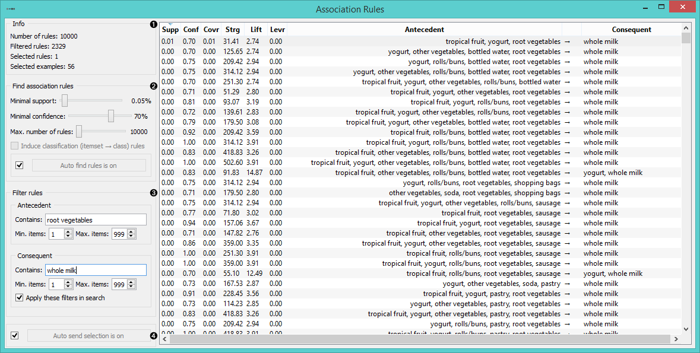
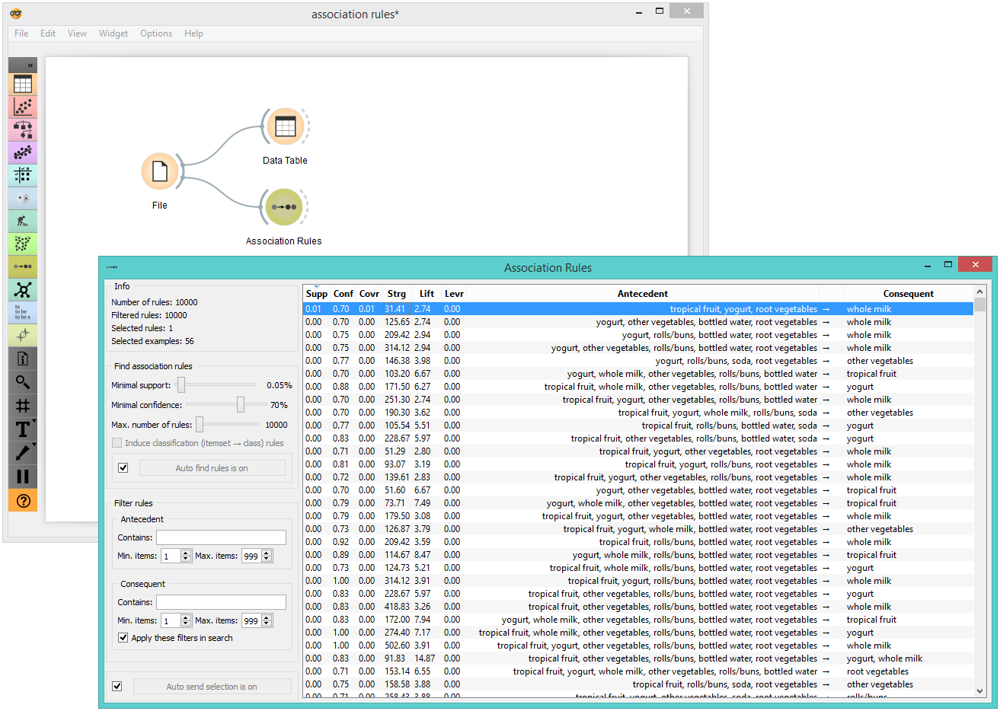

Association Rules
=================

Induction of association rules.

**Inputs**

- Data: Data set

**Outputs**

- Matching Data: Data instances matching the criteria.

This widget implements FP-growth [frequent pattern mining](https://en.wikipedia.org/wiki/Association_rule_learning) algorithm [1] with bucketing optimization [2] for conditional databases of few items. For inducing classification rules, it generates rules for the entire itemset and skips the rules where the consequent does not match one of the class' values.

1. Information on the data set.
2. In *Find association rules* you can set criteria for rule induction:
   - **Minimal support**: percentage of the entire data set covered by the entire rule (antecedent and consequent).
   - **Minimal confidence**: proportion of the number of examples which fit the right side (consequent) among those that fit the left side (antecedent).
   - **Max. number of rules**: limit the number of rules the algorithm generates. Too many rules can slow down the widget considerably.
   If *Induce classification (itemset → class) rules* is ticked, the widget will only generate rules that have a class value on the right-hand side (consequent) of the rule.
   If *Auto find rules is on*, the widget will run the search at every change of parameters. Might be slow for data sets with many attributes, so pressing *Find rules* only when the parameters are set is a good idea.
3. *Filter rules* by

   - **Antecedent**:
      - *Contains*: will filter rules by matching space-separated [regular expressions](https://en.wikipedia.org/wiki/Regular_expression) in antecedent items.
      - *Min. items*: minimum number of items that have to appear in an antecedent.
      - *Max. items*: maximum number of items that can appear in an antecedent.

   - **Consequent**:
      - *Contains*: will filter rules by matching space-separated regular expressions in consequent items.
      - *Min. items*: minimum number of items that have to appear in a consequent.
      - *Max. items*: maximum number of items that can appear in a consequent.

   If *Apply these filters in search* is ticked, the widget will limit the rule generation only to rules that match the filters. If unchecked, all rules are generated, but only the matching are shown.

4. If *Auto send selection is on*, data instances that match the selected association rules are output automatically. Alternatively press *Send selection*.

Example
-------

Association Rules can be used directly with the [File](../data/file.md) widget.

References and further reading
------------------------------

[1]: J. Han, J. Pei, Y. Yin, R. Mao. (2004) [Mining Frequent Patterns without Candidate Generation: A Frequent-Pattern Tree Approach](https://www.cs.sfu.ca/~jpei/publications/dami03_fpgrowth.pdf).

[2]: R. Agrawal, C. Aggarwal, V. Prasad. (2000) [Depth first generation of long patterns](http://www.cs.tau.ac.il/~fiat/dmsem03/Depth%20First%20Generation%20of%20Long%20Patterns%20-%202000.pdf).
