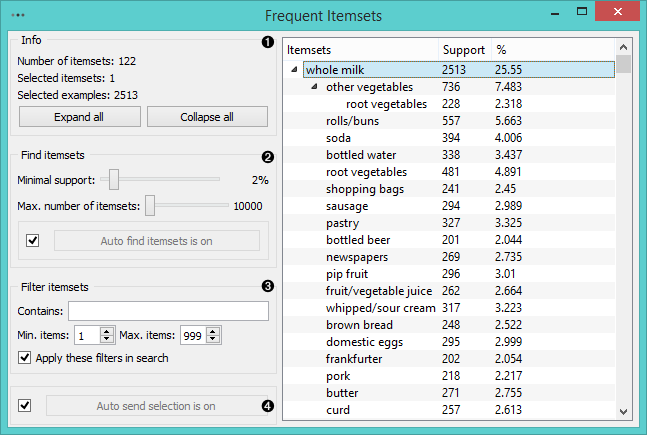
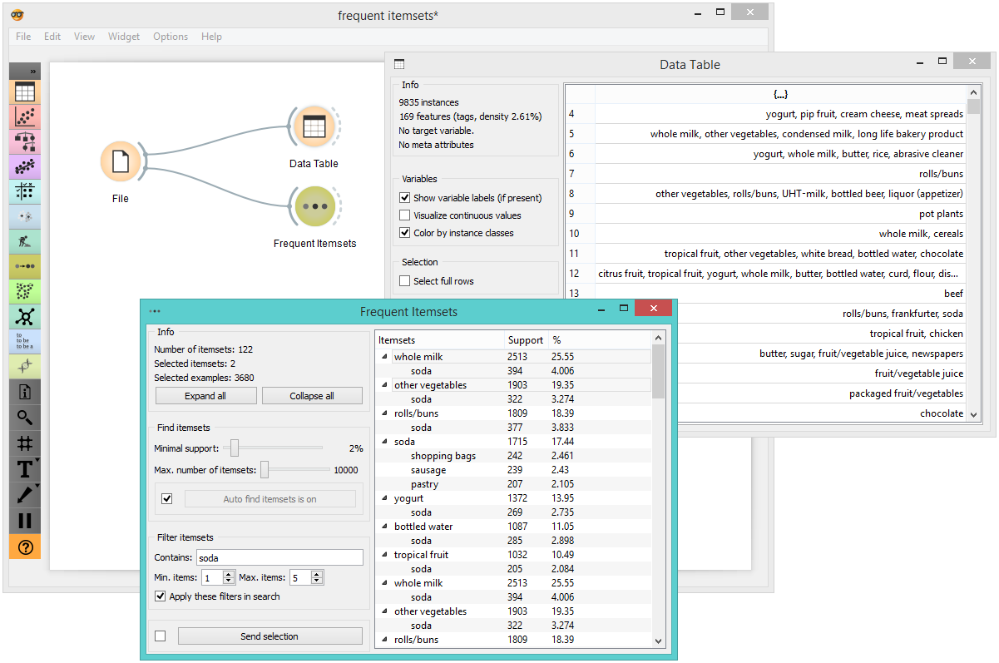

Frequent Itemsets
=================

Finds frequent itemsets in the data.

**Inputs**

- Data: Data set

**Outputs**

- Matching Data: Data instances matching the criteria.

The widget finds [frequent items](https://en.wikipedia.org/wiki/Association_rule_learning) in a data set based on a measure of
support for the rule.

1. Information on the data set. 'Expand all' expands the frequent itemsets tree, while 'Collapse all' collapses it.
2. In *Find itemsets by* you can set criteria for itemset search:
   - **Minimal support**: a minimal ratio of data instances that must support (contain) the itemset for it to be generated. For large data sets it is normal to set a lower minimal support (e.g. between 2%-0.01%).
   - **Max. number of itemsets**: limits the upward quantity of generated itemsets. Itemsets are generated in no particular order.
   If *Auto find itemsets is on*, the widget will run the search at every change of parameters. Might be slow for large data sets, so pressing *Find itemsets* only when the parameters are set is a good idea.
3. *Filter itemsets*:
   If you're looking for a specific item or itemsets, filter the results by [regular expressions](https://en.wikipedia.org/wiki/Regular_expression). Separate regular expressions by comma to filter by more than one word.
   - **Contains**: will filter itemsets by regular expressions.
   - **Min. items**: minimum number of items that have to appear in an itemset. If 1, all the itemsets will be displayed. Increasing it to, say, 4, will only display itemsets with four or more items.
   - **Max. items**: maximum number of items that are to appear in an itemset. If you wish to find, say, only itemsets with less than 5 items in it, you'd set this parameter to 5.
   If *Apply these filters in search* is ticked, the widget will filter the results in real time. Preferably not ticked for large data sets.
4. If *Auto send selection is on*, changes are communicated automatically.
   Alternatively press *Send selection*.

Example
-------

Frequent Itemsets can be used directly with the [File](../data/file.md) widget.

